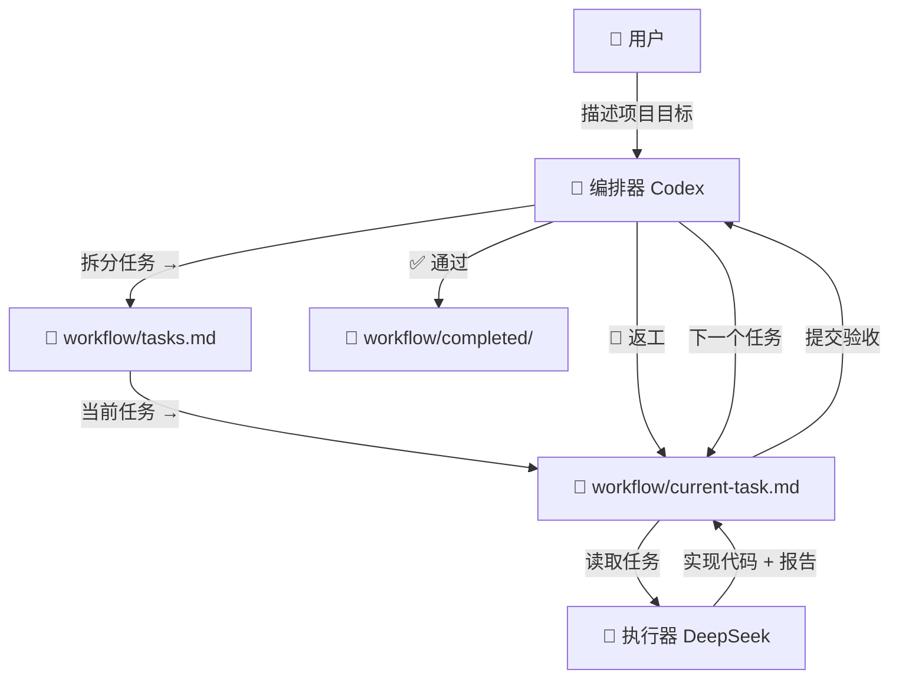

# 🚀 AI 协同开发工作流

> **Codex 管理 · DeepSeek 执行 · VS Code 原生集成**

一种使用两个 AI Agent 协同工作的软件开发方法论：*Codex* 负责任务拆分与验收（编排），*DeepSeek V4 Pro* 负责具体实现（执行）。

---

## 🎯 核心理念

| 角色 | AI | 职责 | 类比 |
|------|-----|------|------|
| 🎯 **编排器** | Codex | 需求分析、任务拆分、验收 | 项目经理 / Tech Lead |
| 🔨 **执行器** | DeepSeek V4 Pro | 按任务清单编码实现 | 高级开发工程师 |

**关键设计**：两个 AI 通过共享的文件系统（`workflow/` 目录）进行通信，无需实时同时运行。



---

## 📦 前置条件

| 组件 | 用途 | 获取方式 |
|------|------|----------|
| **VS Code** | IDE | [下载](https://code.visualstudio.com/) |
| **GitHub Copilot** | AI 编程助手（集成 DeepSeek V4 Pro） | VS Code 扩展市场 |
| **Codex 扩展** | 任务编排（可选，可用 Copilot 的 Orchestrator Agent 替代） | OpenAI Codex CLI 或 VS Code 扩展 |

> ⚠️ **重要说明**：如果只有一个 AI 工具，本工作流同样适用——只需在 Copilot Chat 中切换 Orchestrator Agent 和 Executor Agent 即可。两个 Agent 共用 DeepSeek V4 Pro 模型。

---

## 🏗️ 文件结构

```
your-project/
├── .github/
│   ├── agents/
│   │   ├── orchestrator.agent.md   ← 编排器 Agent 定义
│   │   └── executor.agent.md       ← 执行器 Agent 定义
│   ├── prompts/
│   │   └── new-workflow.prompt.md  ← 快速启动工作流
│   └── copilot-instructions.md     ← 项目级 AI 指令
├── .vscode/
│   └── settings.json               ← VS Code 工作区设置
├── workflow/                       ← 🔑 核心：AI 之间的桥梁
│   ├── tasks.md                    ← 主任务看板
│   ├── current-task.md             ← 当前活跃任务
│   └── completed/                  ← 已完成任务归档
└── README.md                       ← 本文件
```

---

## 🚀 快速开始

### 第一步：安装工作流到你的项目

在项目根目录执行（假设你已经 clone 或复制了这个仓库到本地）：

**Windows (PowerShell)**：
```powershell
cd 你的项目目录
.\路径\ai-collaborative-workflow\install.ps1
```

**Ubuntu / macOS (Bash)**：
```bash
cd 你的项目目录
/path/to/ai-collaborative-workflow/install.sh
```

或者直接在这个项目目录下运行，它会安装到自身：

```powershell
# Windows
cd ai-collaborative-workflow
.\install.ps1
```

原理：安装脚本会把 Agent 和 Prompt 文件复制到**当前工作空间的 `.github/` 目录**，这是最稳定、兼容所有 VS Code 版本的方式。

> ⚠️ VS Code 1.119+ 不读取用户级 `%APPDATA%\Code\User\prompts\` 目录的 Agent/Prompt 文件，必须用工作空间级安装。

### 第二步：在新项目中初始化

```powershell
# Windows - 指定目标项目
.\install.ps1 D:\my-project

# Ubuntu / macOS
./install.sh ~/my-project
```

### 第三步：开始使用

> 在 Copilot Chat 中使用两个 Agent 角色，底层都用 DeepSeek V4 Pro。

**步骤 1**：在 Copilot Chat 中输入 `/new-workflow`，描述你的项目目标

```
/new-workflow 我要做一个用户管理系统，支持注册、登录、权限管理
```

**步骤 2**：编排器会自动拆分任务并写入 `workflow/tasks.md`，并告诉你第一个任务是什么。

**步骤 3**：在 Copilot Chat 的 Agent 选择器中切换到 **Executor (DeepSeek)**，输入：

```
执行当前任务
```

**步骤 4**：执行器完成后，切换回 **Orchestrator**，输入：

```
验收当前任务
```

**步骤 5**：重复步骤 3-4，直至所有任务完成。

---

### 方案 B：双工具模式（Codex + Copilot）

> 使用 Codex 扩展做编排、Copilot（DeepSeek）做执行。

**步骤 1**：在 Codex Chat 中描述你的项目目标，让 Codex 拆分任务到 `workflow/tasks.md`。

**步骤 2**：在 Copilot Chat 中选择 **Executor (DeepSeek)** Agent，说 "执行当前任务"。

**步骤 3**：切回 Codex Chat，让 Codex 验收结果。

**步骤 4**：重复步骤 2-3。

---

## 📋 任务状态流转

```
⬜ 待执行 ──→ 🟡 执行中 ──→ 🔍 待验收 ──→ ✅ 已完成
                                    │
                                    └──→ 🔄 需返工 ──→ 🟡 执行中
```

| 状态 | 含义 | 谁操作 |
|------|------|--------|
| ⬜ 待执行 | 已拆分，等待分配 | 编排器 |
| 🟡 执行中 | 执行器正在处理 | 执行器 |
| 🔍 待验收 | 执行完成，等待验收 | 编排器 |
| ✅ 已完成 | 验收通过，已归档 | 编排器 |
| 🔄 需返工 | 验收不通过，需修改 | 编排器 |
| ⏸️ 已暂停 | 暂时搁置 | 编排器 |

---

## 🔧 VS Code 配置说明

### Agent 选择器

在 Copilot Chat 输入框上方，使用 Agent 下拉菜单选择：

- **Orchestrator (Codex)** — 规划模式
- **Executor (DeepSeek)** — 执行模式（默认）

### 默认 Agent

已在 `.vscode/settings.json` 中设置默认 Agent 为 Executor，因为大部分时间在执行任务。

### 斜杠命令

| 命令 | 作用 |
|------|------|
| `/new-workflow` | 启动新的 AI 协同工作流 |
| `@orchestrator` | 手动切换到编排器 |
| `@executor` | 手动切换到执行器 |

---

## 📝 最佳实践

### 编排器（任务拆分）

1. **每个任务应在一次执行会话内可完成**——不要拆分过大或过小
2. **验收标准要具体可测**——不要用 "代码看起来不错"
3. **考虑依赖关系**——被依赖的任务排在前面
4. **提供充足上下文**——包含文件路径、技术栈、模式参考

### 执行器（任务实现）

1. **始终先读 `workflow/current-task.md`**——上下文在文件里
2. **严格按验收标准实现**——不要偏离任务范围
3. **完成所有标准后再提交**——不要遗漏
4. **记录遇到的问题**——帮助编排器优化后续任务
5. **不要修改 `workflow/tasks.md`**——那是编排器的职责

### 用户（你）

1. **不要在两个 Agent 同时修改文件**——避免冲突
2. **验收不通过时提供额外上下文**——帮助执行器理解
3. **可以手动调整优先级**——在 `workflow/tasks.md` 中直接编辑
4. **复杂项目分批拆分**——一次不要超过 10 个任务

---

## 🔍 示例流程

### 示例：开发一个 TODO 应用

**第一步：启动工作流（编排器）**

```
用户: /new-workflow 开发一个命令行 TODO 应用，支持添加、列出、完成、删除任务
```

编排器拆分结果（`workflow/tasks.md`）：

| 编号 | 任务 | 状态 | 优先级 |
|------|------|------|--------|
| T001 | 初始化项目和数据结构 | ⬜ | 🔴 |
| T002 | 实现添加任务功能 | ⬜ | 🔴 |
| T003 | 实现列出任务功能 | ⬜ | 🔴 |
| T004 | 实现完成任务功能 | ⬜ | 🟡 |
| T005 | 实现删除任务功能 | ⬜ | 🟡 |
| T006 | 添加单元测试 | ⬜ | 🟢 |
| T007 | 编写 README | ⬜ | 🟢 |

第一个任务 `workflow/current-task.md`：**T001 - 初始化项目和数据结构**

**第二步：执行（执行器）**

```
用户: @executor 执行当前任务
```

执行器读取 `current-task.md`，创建项目结构、数据结构定义等，完成后更新执行记录。

**第三步：验收（编排器）**

```
用户: @orchestrator 验收当前任务
```

编排器检查代码，对照验收标准，标记通过，指派下一个任务。

**...循环直至 T007 完成...**

---

## ⚙️ 高级配置

### 自定义 Agent 的工具权限

在 `.github/agents/orchestrator.agent.md` 中修改 `tools` 字段：

```yaml
# 只读编排器
tools: [read, search, web, todo]

# 带终端权限的编排器
tools: [read, edit, execute, search, web, todo]
```

### 添加 MCP 工具

```yaml
tools: [read, edit, execute, search, github/*]
```

### 用户级 Agent（跨项目复用）

将 Agent 文件放到 `{{VSCODE_USER_PROMPTS_FOLDER}}/agents/` 目录下，所有项目都能使用。

---

## ❓ 常见问题

### Q: 两个 Agent 能同时运行吗？

不能，也不需要。工作流的核心是**串行协作**——编排器规划 → 执行器实现 → 编排器验收。通过文件状态来同步。

### Q: 如果没有 Codex 怎么办？

用 Copilot 的 Orchestrator Agent 完全替代。两个 Agent 声明了同一个模型 `DeepSeek V4 Pro (copilot)`，但角色不同。

### Q: 任务太复杂，一次执行不完怎么办？

执行器应尽量完成。如果有困难，在执行记录中注明，编排器会决定是否拆分任务。

### Q: 能并行执行多个任务吗？

如果任务之间无依赖，可以手动为每个任务创建独立的 task 文件（如 `current-task-2.md`），但建议串行执行以保持清晰。

### Q: 想修改工作流行为怎么办？

所有行为都是纯文本文件定义的，直接编辑 `.agent.md` 或 `.prompt.md` 即可，保存后立即生效。更详细的参考下表：

| 想改什么 | 编辑哪个文件 |
|----------|-------------|
| 编排器拆分任务粒度 | `.github/agents/orchestrator.agent.md` |
| 执行器的工作流程 | `.github/agents/executor.agent.md` |
| 默认 Agent | `.vscode/settings.json` |
| 启动命令行为 | `.github/prompts/new-workflow.prompt.md` |

### Q: 如何在其他电脑上使用？

**方法 1（推荐）**：把本项目放到 Git 仓库，新电脑 clone 后运行 `.\install.ps1` 即可。

**方法 2**：直接复制 `install.ps1` 和 `.github/` 目录到新电脑，运行安装脚本。

**方法 3**：如果开启了 VS Code Settings Sync，用户级目录下的 Agent 文件会自动同步到新电脑。

---

## 📚 相关资源

- [VS Code Copilot Customization](https://code.visualstudio.com/docs/copilot/customization/overview)
- [GitHub Copilot Custom Agents](https://code.visualstudio.com/docs/copilot/customization/custom-agents)
